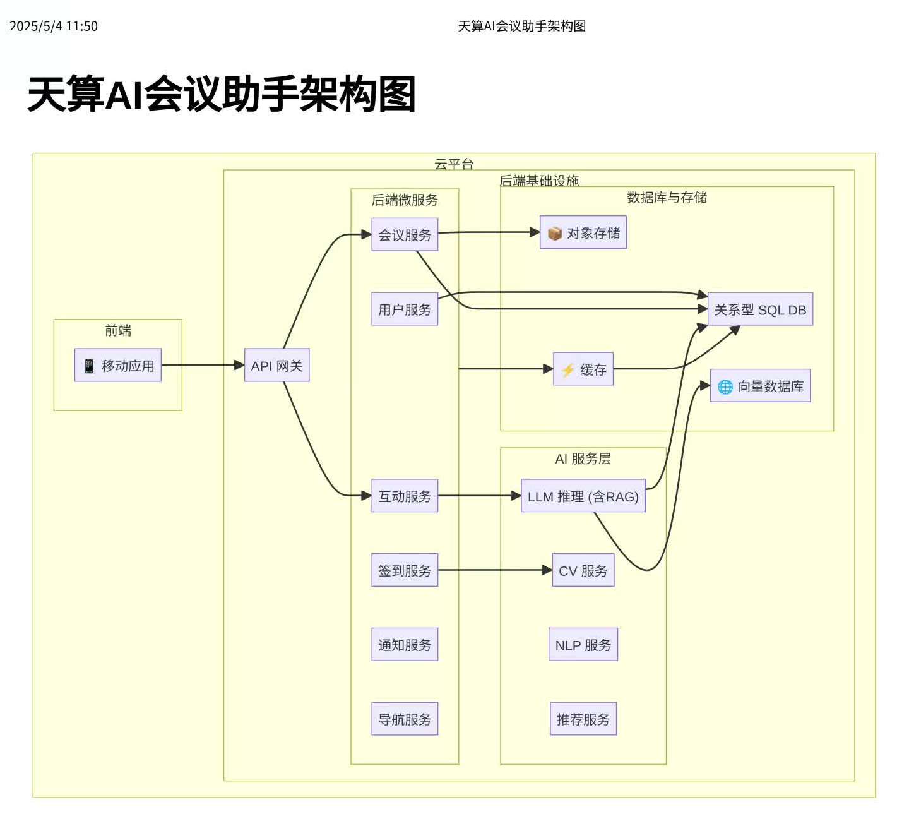

# TianSuan AI Conference Assistant Showcase (天算AI会议助手成果展示)

 <!-- Replace with your actual HF Space link -->

## Overview (项目概述)

This repository showcases the concept, architecture, and AI capabilities of the **TianSuan AI Conference Assistant**, a system designed to power large-scale conferences entirely through AI, minimizing human intervention and maximizing efficiency, security, and attendee experience. This project demonstrates how TianSuan AI leverages Large Language Models (LLMs), Computer Vision (CV), and other AI technologies to revolutionize event management.

本项目旨在展示**天算AI会议助手**的设计理念、系统架构和核心AI能力。该系统旨在通过AI全面赋能大型会议，实现无人值守，显著提升会议效率、安全性与参会者体验。本项目体现了天算AI如何运用大语言模型（LLM）、计算机视觉（CV）等AI技术革新会务管理模式。

**Target Conference Example (目标会议示例):**
*   **Name:** 2024 TianSuan AI National Annual Conference - "Intelligent Computing the Future, Charting a New Chapter Together" (2024天算AI全国年会 - “智算未来，共绘新篇”)
*   **Date:** November 15-16, 2024 (2024年11月15日-16日)
*   **Location:** Hangzhou Future Sci-Tech City International Conference Center (Fictional) (中国杭州未来科技城国际会议中心 - 虚拟地点)
*   **Scale:** ~100 Attendees (公司高管、核心骨干、区域负责人、特邀嘉宾等约100人)

**Note:** This repository contains **conceptual documentation, architectural diagrams, and illustrative examples ONLY**. It does **NOT** include the actual application source code, proprietary AI models, or internal data of TianSuan AI. The Hugging Face Space linked above provides an interactive demo using public models and synthetic data.
**请注意：** 本仓库仅包含**概念文档、架构图和说明性示例**。它**不包含**实际的应用源代码、天算AI的专有AI模型或内部数据。上方链接的Hugging Face Space提供了一个使用公开模型和模拟数据的交互式演示。

## The Problem (解决的问题)

Traditional large conferences suffer from:
*   High costs for security, reception, and guidance staff.
*   Attendee confusion regarding schedules, locations, and information access.
*   Inconsistent VIP reception and complex security coordination.
*   Lack of personalized experience and efficient networking.

传统大型会议面临诸多痛点：
*   安保、接待、引导等人力成本高昂。
*   参会者对日程、地点、信息获取感到迷茫，提问频繁。
*   重要嘉宾接待难以周全，安保协调复杂。
*   缺乏个性化体验和高效的社交连接。

## Our Solution: AI-Powered Conference (我们的解决方案：AI赋能会议)

The TianSuan AI Conference Assistant centralizes all conference functions into a mobile app, powered by a sophisticated AI backend:

天算AI会议助手将所有会议功能集成到一个手机APP中，由强大的AI后端驱动：

*   **AI Concierge (AI 礼宾):** A fine-tuned LLM answers any attendee questions 24/7. (基于微调大模型的智能问答，7x24小时响应。)
*   **AI Check-in (AI 签到):** Facial recognition or QR code scanning via the app, no staff needed. (通过APP进行人脸识别或扫码，无需人工。)
*   **Personalized Agenda & Navigation (个性化议程与导航):** Real-time schedule updates, reminders, and indoor/outdoor map navigation. (实时日程、提醒、室内外地图导航。)
*   **Intelligent Q&A & Interaction (智能问答与互动):** Submit questions during sessions, AI summarization, feedback collection. (会中提问、AI纪要、反馈收集。)
*   **Automated Logistics (自动化后勤):** Personalized meal/accommodation info, AI-guided gift pickup. (个性化食宿信息、AI引导礼品领取。)
*   **Enhanced Security (强化安防):** AI-powered monitoring for anomaly detection and emergency routing. (AI监控异常检测、紧急疏散路线规划。)
*   **Smart Networking (智能社交):** AI-driven recommendations for connecting with relevant attendees. (AI推荐匹配的参会者。)

## Architecture (系统架构)

(A high-level diagram illustrating the Mobile App, Cloud Backend Microservices, AI Models, Databases, and interactions)
（此处嵌入一张清晰的系统架构图，展示APP、云后端微服务、AI模型、数据库之间的关系）

 <!-- Make sure this image exists -->

*See `/docs/architecture.md` for more details.*
*详见 `/docs/architecture.md`。*

## AI Empowerment Details (AI赋能详解)

*   **Fine-tuned LLM:** Provides expert knowledge about *this specific* conference. (针对本次会议数据微调的大模型提供专家级问答能力。)
*   **RAG (Retrieval-Augmented Generation):** LLM retrieves information from structured (DB) and unstructured (Vector DB) knowledge bases before answering. (LLM在回答前从结构化数据库和向量数据库中检索信息。)
*   **Computer Vision:** Powers facial recognition check-in and security monitoring. (计算机视觉负责人脸识别签到和安防监控。)
*   **NLP:** Handles speech-to-text for summaries, sentiment analysis for feedback. (自然语言处理负责语音转文本及反馈情感分析。)
*   **Recommendation Engine:** Suggests relevant sessions and networking contacts. (推荐引擎建议相关议程和社交对象。)

*See `/docs/ai_models.md` for more details.*
*详见 `/docs/ai_models.md`。*

## Technology Stack (技术栈 - 示例)

*   **Mobile App:** React Native / Flutter
*   **Backend:** Python (FastAPI/Django), Microservices Architecture
*   **LLM:** TianSuan Custom Model / Fine-tuned Open Source Model (e.g., Llama 3, Qwen)
*   **Databases:** PostgreSQL (Structured), Milvus/ChromaDB (Vector)
*   **Cloud Platform:** AWS / Azure / Alibaba Cloud
*   **CV/NLP Libraries:** OpenCV, PyTorch/TensorFlow, Transformers

## Interactive Demo (交互式演示)

Experience a simplified version of the AI Assistant's Q&A capabilities on Hugging Face Spaces:
在Hugging Face Spaces上体验AI助手核心问答功能的简化演示版：

 <!-- Replace with your actual HF Space link -->

---
## 💖 支持 天算AI 的创新探索 (Support TianSuan AI's Innovative Explorations)

如果您对 **天算AI会议助手** 这样的概念展示项目及其背后的AI技术探索感兴趣，并希望支持我们持续进行这类创新概念的构思、原型设计和开源分享，欢迎通过以下方式表达您的支持：

*   **通过 PayPal.Me 快速捐款：**
    [https://paypal.me/jinv2](https://paypal.me/jinv2)

    

您的每一份支持都将鼓励我们探索更多AI赋能的创新应用场景！

---

## Getting Started (如何理解本项目)

1.  Explore the documentation in the `/docs` folder to understand the system design.
2.  Review the example API definitions in `/docs/api_design_examples.md`.
3.  Try the interactive demo linked above.

## License (许可证)

This showcase project is licensed under the [MIT License](./LICENSE).
