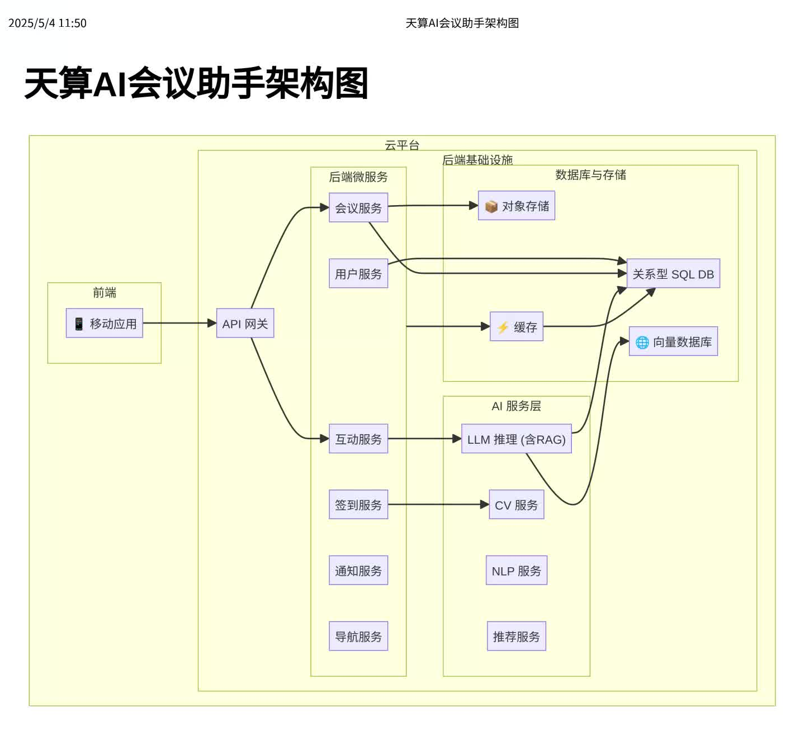

# System Architecture (系统架构)

This document outlines the high-level architecture of the TianSuan AI Conference Assistant system. The architecture is designed for scalability, reliability, and maintainability, leveraging modern cloud-native principles and AI technologies.

本文档概述了天算AI会议助手系统的高层架构。该架构旨在实现可扩展性、可靠性和可维护性，利用了现代云原生原则和AI技术。

*(This diagram should visually represent the components described below and their interactions.)*
*（上图应可视化展示下述组件及其交互关系。）*

## Core Components (核心组件)

1.  **Mobile Application (前端移动应用):**
    *   **Platform:** Cross-platform (React Native or Flutter) for iOS and Android.
    *   **Functionality:** Provides the user interface for attendees to access all conference information, interact with AI services, manage their profile, and receive notifications.
    *   **Key Features:** Personalized agenda, AI chat assistant, indoor/outdoor navigation, AI check-in (via camera/QR), session Q&A, notifications, profile management.
    *   **平台：** 跨平台（React Native 或 Flutter），支持iOS和Android。
    *   **功能：** 为参会者提供用户界面，访问所有会议信息、与AI服务交互、管理个人资料、接收通知。
    *   **关键特性：** 个性化议程、AI聊天助手、室内外导航、AI签到（通过摄像头/二维码）、会中问答、通知推送、个人资料管理。

2.  **API Gateway (API 网关):**
    *   **Technology:** Standard API Gateway service (e.g., AWS API Gateway, Kong, Nginx).
    *   **Functionality:** Acts as the single entry point for all requests from the mobile app. Handles authentication, authorization, rate limiting, request routing, and basic transformations. Decouples the frontend from backend microservices.
    *   **技术：** 标准API网关服务（如 AWS API Gateway, Kong, Nginx）。
    *   **功能：** 作为移动应用所有请求的单入口点。处理认证、授权、速率限制、请求路由和基本转换。将前端与后端微服务解耦。

3.  **Backend Microservices (后端微服务):**
    *   **Architecture:** A set of independent, focused services communicating typically via REST APIs or message queues.
    *   **Technology:** Python (FastAPI/Django), Java (Spring Boot), or Go, containerized using Docker.
    *   **Example Services:**
        *   **User Service:** Manages user profiles, authentication tokens, preferences.
        *   **Conference Service:** Stores and serves conference metadata (agenda, speakers, locations, documents).
        *   **Notification Service:** Handles push notifications to the mobile app.
        *   **Check-in Service:** Processes check-in requests, interacts with CV models if needed.
        *   **Interaction Service:** Manages session Q&A, polls, feedback.
        *   **Navigation Service:** Provides map data and routing information.
    *   **架构：** 一组独立的、专注的服务，通常通过REST API或消息队列通信。
    *   **技术：** Python (FastAPI/Django), Java (Spring Boot), 或 Go，使用Docker容器化。
    *   **服务示例：**
        *   **用户服务：** 管理用户资料、认证令牌、偏好设置。
        *   **会议服务：** 存储和提供会议元数据（议程、嘉宾、地点、文档）。
        *   **通知服务：** 处理向移动应用的推送通知。
        *   **签到服务：** 处理签到请求，需要时与CV模型交互。
        *   **互动服务：** 管理会中问答、投票、反馈。
        *   **导航服务：** 提供地图数据和路径规划信息。

4.  **AI Services Layer (AI 服务层):**
    *   **Functionality:** Hosts and serves the AI models required by the system. Exposed as APIs callable by the backend microservices.
    *   **Components:**
        *   **LLM Inference Service:** Hosts the fine-tuned Large Language Model for Q&A, summarization, etc. Includes logic for RAG.
        *   **CV Service:** Hosts computer vision models (e.g., facial recognition for check-in, anomaly detection).
        *   **NLP Service:** Provides text processing capabilities (speech-to-text, sentiment analysis).
        *   **Recommendation Service:** Generates personalized suggestions.
    *   **功能：** 托管并提供系统所需的AI模型服务。以API形式暴露给后端微服务调用。
    *   **组件：**
        *   **LLM推理服务：** 托管微调后的大语言模型，用于问答、摘要等。包含RAG逻辑。
        *   **CV服务：** 托管计算机视觉模型（如人脸识别签到、异常检测）。
        *   **NLP服务：** 提供文本处理能力（语音转文本、情感分析）。
        *   **推荐服务：** 生成个性化推荐。

5.  **Databases & Storage (数据库与存储):**
    *   **Structured Data:** Relational Database (e.g., PostgreSQL, MySQL) to store user information, conference schedules, locations, registration details, feedback ratings.
    *   **Unstructured/Vector Data:** Vector Database (e.g., Milvus, ChromaDB, FAISS) to store embeddings of documents (reports, Q&A pairs) for efficient similarity search by the RAG system.
    *   **Object Storage:** Cloud storage (e.g., AWS S3, Azure Blob Storage) for storing large files like profile pictures, presentation documents (PPTs, PDFs), map tiles.
    *   **Cache:** In-memory data store (e.g., Redis, Memcached) for caching frequently accessed data (like current agenda, popular questions) to improve performance.
    *   **结构化数据：** 关系型数据库（如 PostgreSQL, MySQL）存储用户信息、会议日程、地点、注册详情、评分反馈。
    *   **非结构化/向量数据：** 向量数据库（如 Milvus, ChromaDB, FAISS）存储文档（报告、问答对）的嵌入向量，供RAG系统进行高效相似性搜索。
    *   **对象存储：** 云存储（如 AWS S3, Azure Blob Storage）存储大文件，如头像、演示文稿（PPT, PDF）、地图瓦片。
    *   **缓存：** 内存数据存储（如 Redis, Memcached）缓存常用数据（如当前议程、热门问题）以提升性能。

6.  **Cloud Platform (云平台):**
    *   The entire backend system (microservices, AI models, databases) is deployed on a major cloud platform (e.g., AWS, Azure, Alibaba Cloud) for scalability, reliability, and managed services. Kubernetes might be used for container orchestration.
    *   整个后端系统（微服务、AI模型、数据库）部署在主流云平台（如 AWS, Azure, 阿里云）上，以获得可扩展性、可靠性和托管服务。可能使用Kubernetes进行容器编排。

## Data Flow Example (数据流示例 - AI 问答)

1.  Attendee asks a question in the Mobile App's AI Assistant chat.
2.  App sends the query via HTTPS to the API Gateway.
3.  Gateway authenticates the request and routes it to the relevant backend microservice (e.g., Interaction Service).
4.  Interaction Service logs the query and calls the AI Services Layer (LLM Inference Service).
5.  LLM Service implements RAG:
    *   It queries the Vector Database for relevant document chunks based on the query's embedding.
    *   It may also query the SQL Database via another service for structured context (e.g., user's current location, upcoming agenda).
    *   It constructs a prompt containing the original query and the retrieved context.
    *   It sends the prompt to the fine-tuned LLM for generation.
6.  The LLM generates an answer based *only* on the provided context and its fine-tuned knowledge.
7.  The answer is returned through the services back to the Mobile App.
8.  The App displays the answer to the attendee.

This modular architecture allows for independent scaling and development of different system parts and facilitates the integration of diverse AI capabilities.
这种模块化架构允许系统不同部分的独立扩展和开发，并便于集成各种AI能力。
